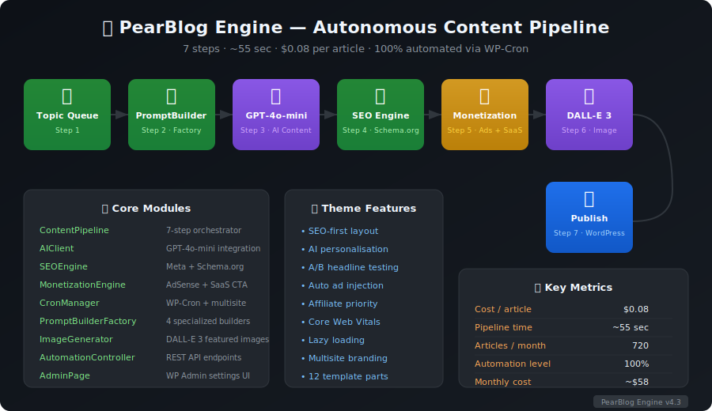

# PearBlog Engine PRO

**Autonomous AI content production system for WordPress — v6.0**

📚 **[Documentation Index →](DOCUMENTATION-INDEX.md)** · 📋 **[Changelog →](CHANGELOG.md)** · ⚙️ **[Setup →](SETUP.md)** · 🗺️ **[Roadmap →](ROADMAP-VISUAL.md)** · 📊 **[Progress →](PROGRESS-VISUALIZATION.md)** · 🤖 **[Autopilot →](ENTERPRISE-AUTOPILOT-TASKLIST.md)**

---

## Screenshots & Diagrams

| Diagram | Preview |
|---------|---------|
| [Pipeline Overview](brand-assets/screenshots/pipeline-overview.svg) | 12-step autonomous content pipeline with metrics |
| [System Architecture](brand-assets/screenshots/architecture.svg) | All 16 modules, external integrations, WordPress core |
| [Admin Panel — General](brand-assets/screenshots/admin-panel.svg) | WP Admin tabbed settings UI mockup |
| [Queue Manager](brand-assets/screenshots/queue-manager.svg) | Topic queue, pipeline trigger, add-topics form |
| [Monitoring Dashboard](brand-assets/screenshots/monitoring-dashboard.svg) | Metric cards, alert history table, action buttons |



---

## What It Does

PearBlog Engine generates, optimizes, and publishes SEO articles autonomously — every hour via WP-Cron — with zero manual intervention.

**Pipeline (12 steps, ~55 sec, $0.08/article):**

```
Topic Queue → PromptBuilder → GPT-4o-mini → DuplicateCheck → Draft
  → SEOEngine → MonetizationEngine → InternalLinker → DALL-E 3
  → DuplicateIndex → Publish → QualityScore + Alert
```

---

## Quick Start

```bash
# 1. Copy plugin + theme into WordPress
cp -r mu-plugins/pearblog-engine /path/to/wp-content/mu-plugins/
cp -r theme/pearblog-theme       /path/to/wp-content/themes/

# 2. Set API key (wp-config.php or WP Admin → PearBlog Engine)
define('PEARBLOG_OPENAI_API_KEY', 'sk-...');

# 3. Add topics in the admin queue → pipeline runs automatically every hour
```

See **[SETUP.md](SETUP.md)** for GitHub Actions setup and **[AUTONOMOUS-ACTIVATION-GUIDE.md](AUTONOMOUS-ACTIVATION-GUIDE.md)** for full activation.

---

## Repository Structure

```
PearBlog-Engine/
├── mu-plugins/pearblog-engine/          # Core WordPress MU-plugin
│   ├── pearblog-engine.php              # Bootstrap (PSR-4 autoload)
│   ├── assets/css/admin.css             # Admin panel styles
│   └── src/
│       ├── Pipeline/ContentPipeline.php # 8-step autonomous flow
│       ├── AI/
│       │   ├── AIClient.php             # GPT-4o-mini integration
│       │   ├── ImageGenerator.php       # DALL-E 3 featured images
│       │   └── ImageAnalyzer.php        # Media library audit & keyword suggestions
│       ├── SEO/
│       │   ├── SEOEngine.php            # Meta tags (Yoast/RankMath compat)
│       │   └── ProgrammaticSEO.php      # Schema.org, Open Graph, SEO audit
│       ├── Content/                     # 4 prompt builders + validator
│       ├── Monetization/               # AdSense + Affiliate + SaaS CTA injection
│       ├── Scheduler/CronManager.php   # WP-Cron + multisite
│       ├── Admin/AdminPage.php         # WP Admin — top-level menu + tabbed UI
│       ├── API/AutomationController.php# REST API endpoints
│       ├── Keywords/                   # Keyword clustering
│       └── Tenant/                     # Multi-site context
│
├── theme/pearblog-theme/               # SEO-first WordPress theme v5.1
│   ├── index.php                       # Homepage with hero + card grid
│   ├── single.php                      # 12-element SEO article layout
│   ├── page.php                        # Static page template
│   ├── search.php                      # Search results template
│   ├── 404.php                         # Error page
│   ├── category.php                    # Category archive
│   ├── inc/                            # 16 modules (monetization, analytics, etc.)
│   ├── template-parts/                 # 13 reusable block templates
│   └── assets/
│       ├── css/                        # base, components, utilities, admin styles
│       └── js/                         # app, lazyload, personalization
│
├── scripts/                            # Python automation (optional)
│   ├── automation_orchestrator.py      # Full-cycle orchestration
│   ├── keyword_engine.py              # Keyword research
│   ├── scraping_engine.py             # SERP data extraction
│   ├── serp_analyzer.py               # Competition analysis
│   └── run_pipeline.py                # GitHub Actions runner
│
├── examples/                           # Usage examples
├── brand-assets/                       # Brand guidelines
├── SETUP.md                            # Installation guide
├── BUSINESS-STRATEGY.md                # ROI & monetization strategy
├── MARKETING-GUIDE.md                  # SEO & traffic acquisition
├── TRAVEL-CONTENT-ENGINE.md            # Specialized travel builders
├── PRODUCTION-ANALYSIS-FULL.md         # Complete operations manual
└── CHANGELOG.md                        # Release history
```

---

## Content Generation Engines

| Builder | Use Case | Language |
|---------|----------|----------|
| `PromptBuilder` | Generic SEO content for any industry | configurable |
| `TravelPromptBuilder` | Structured travel content with mandatory sections | configurable |
| `BeskidyPromptBuilder` | Beskidy mountains — weather + day planner | PL |
| `MultiLanguageTravelBuilder` | Culturally localized travel content | PL / EN / DE |

Builder selection is automatic via `PromptBuilderFactory` (based on industry keywords). Override with the `pearblog_prompt_builder_class` filter.

---

## Programmatic SEO (v5.1)

Automated SEO applied to every article, no plugins required:

| Feature | Description |
|---------|-------------|
| **Schema.org JSON-LD** | Article + BreadcrumbList + FAQPage structured data |
| **Open Graph** | og:title, og:description, og:image (1792×1024) |
| **Twitter Cards** | summary_large_image with auto-populated fields |
| **Auto Meta Descriptions** | Generated from content when AI doesn't produce one |
| **Keyword Density** | Analyses and reports density for target keywords |
| **Bulk SEO Audit** | Scans all posts for issues (thin content, missing H2, etc.) |
| **Internal Link Suggestions** | Keyword-based related post discovery |

---

## Image Generator & Analyzer (v5.1)

| Feature | Description |
|---------|-------------|
| **DALL-E 3 generation** | Generates featured images from article titles/keywords |
| **Keyword-based prompts** | Admin UI to generate images from custom keyword sets |
| **Batch generation** | Detect and fill posts missing featured images |
| **Media audit** | Summary: total images, AI-generated, missing alt texts |
| **Alt text auto-fix** | Bulk-generate alt texts from image titles/filenames |
| **Oversized image detection** | Flags images exceeding recommended dimensions |

---

## Admin Panel (v5.1)

Top-level **PearBlog Engine** menu in WordPress admin with tabbed sections:

- **General** — API keys, niche, tone, language, publish rate
- **AI Images** — DALL-E 3 toggle, style, batch generation, media audit
- **Programmatic SEO** — Audit results, auto-fix meta descriptions
- **Monetization** — AdSense, Booking.com, SaaS CTA products (JSON)
- **Email** — Mailchimp / ConvertKit integration
- **Queue** — Topic queue management (add / view / clear)

---

## Theme Features (v5.1)

- **SEO layout:** H1 → TL;DR → Ads → Affiliate → TOC → Content → FAQ → Related
- **Reading progress bar** — Sticky top indicator that fills as user scrolls
- **Dark mode** — Toggle button in header; respects `prefers-color-scheme`
- **Search panel** — Slide-down search form triggered from header icon
- **Sticky header** — Shrinks on scroll, stays at top with shadow
- **AI Personalization (v4):** Dynamic headlines, CTAs, recommendations
- **A/B Testing:** Automatic headline testing with daily winner detection
- **Monetization:** Auto ad injection, affiliate priority (Booking → Airbnb), SaaS CTA
- **Performance:** Lazy loading, Core Web Vitals, ~8 KB personalization JS
- **Missing templates added:** `page.php`, `search.php`, `404.php`
- **Multisite:** Per-site branding, colours, feature toggles

---

## Key Metrics

| Metric | Value |
|--------|-------|
| Cost per article (with image) | $0.08 |
| Pipeline execution time | ~55 sec |
| Articles / month (rate=1) | 720 |
| Monthly cost (720 articles) | ~$58 |
| Break-even traffic | ~5,000 visitors/mo |
| Automation level | 100% |

---

## Documentation

| Document | What It Covers |
|----------|----------------|
| [SETUP.md](SETUP.md) | GitHub Actions & initial configuration |
| [DEPLOYMENT.md](DEPLOYMENT.md) | Production deployment guide (EN) — Apache/Nginx, SSL, Git, CI/CD, 4 hosting providers |
| [DEPLOYMENT-PL.md](DEPLOYMENT-PL.md) | Przewodnik wdrożenia produkcyjnego (PL) |
| [PROGRESS-VISUALIZATION.md](PROGRESS-VISUALIZATION.md) | Bilingual progress visualization — milestones, timeline, metrics (PL + EN) |
| [AUTONOMOUS-ACTIVATION-GUIDE.md](AUTONOMOUS-ACTIVATION-GUIDE.md) | Step-by-step autonomous launch (PL) |
| [PRODUCTION-ANALYSIS-FULL.md](PRODUCTION-ANALYSIS-FULL.md) | Complete operations manual (PL) |
| [BUSINESS-STRATEGY.md](BUSINESS-STRATEGY.md) | ROI, monetization, scaling |
| [MARKETING-GUIDE.md](MARKETING-GUIDE.md) | SEO, traffic, affiliate strategy |
| [TRAVEL-CONTENT-ENGINE.md](TRAVEL-CONTENT-ENGINE.md) | Specialised travel prompt builders |
| [theme/pearblog-theme/README.md](theme/pearblog-theme/README.md) | Theme features & configuration |
| [mu-plugins/pearblog-engine/README.md](mu-plugins/pearblog-engine/README.md) | Plugin architecture & filters |
| [scripts/README.md](scripts/README.md) | Python automation suite |

---

## Tech Stack

- **PHP 8.0+** · WordPress 6.0+ · Vanilla JS · CSS Custom Properties
- **AI:** OpenAI GPT-4o-mini (content) + DALL-E 3 (images)
- **Fonts:** Poppins (display) · Inter (UI) · JetBrains Mono (code)
- **Python 3.11** (optional automation scripts)

## License

GNU General Public License v2 or later
